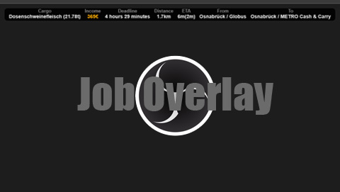
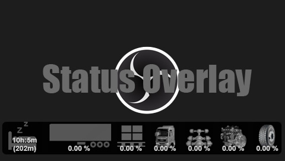

**ATTENTION: This is not working anymore!**  
An alternative can be found here:  
https://github.com/dichternebel/scs-telemetry-json-service

# ETS2 telemetry overlay for OBS 
Overlay for OBS visualizing ETS2 telemetry data.

## OBS Job Overlay

## OBS Status Overlays

## Prerequisites

- Download and install the [ETS2 Telemetry Web Server 3.2.5 + Mobile Dashboard](https://github.com/Funbit/ets2-telemetry-server/archive/refs/heads/master.zip)
- Download the [ETS2-Telemetry-Overlay](https://github.com/dichternebel/ets2-telemetry-overlay/archive/refs/heads/main.zip) as zip file or git clone this repo
- Extract the content of the `main.zip` into the `.\ets2-telemetry-server-master\server\Html\skins` folder of the web server

## Configure OBS

- Add two browser sources to OBS for the job and the status telemetry overlays
- Change thir size to width 1920 x height 1080 (not manually, go to the settings dialog of the browser source!)
- Run ETS2 Telemetry Server and click on the URL that points to the HTML5 App URL, click the overlays and copy their URLs for being used in OBS (might not be visible if not yet connected to ETS2 and not having an active job)
- Paste the URLs for job overlay and status overlay in to the browser source URL field in OBS

## Trouble shooting

- Make sure you start ETS2 prior ETS2 Telemetry Web Server and finally start OBS
- If the browser sources do not update, refresh them manually once everything is running
- Disable browser hardware acceleration in OBS (that's always a good idea)
- The overlays only show up when having an **active job** and when **driving**, not in the menus/when game is paused/when cruising around
